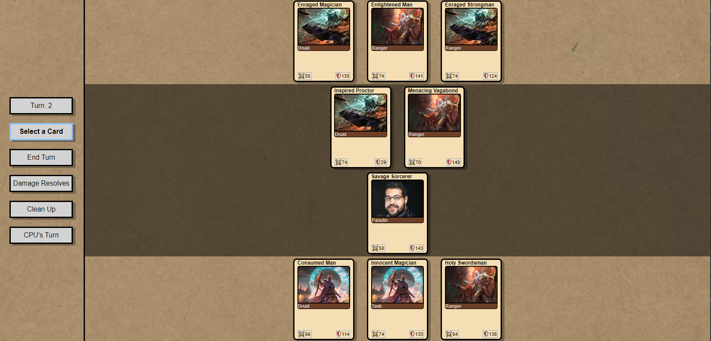

# My Awesome Project
A dubious card game.

**Link to project:** https://replit.com/@KevinSolonIV/StableBreakableGigahertz#index.js

## How It's Made:

**Tech used:** HTML, CSS, JavaScript, Node.js

This was a team project that started as an experiment in combining a backend API with a dynamic frontend. The cards are generated serverside and passed to the client using JSON, so none of the stats or names are generated locally. This game was also a great opportunity to look at state-based interface design, and included a lot of team discussion to decide on gameplay and design decisions.

## Lessons Learned:

In an interactive experience like I was trying to build with this project, it is very important to space things out in time: it feels sudden and unpleasant when the computer takes its turn instantly. Even if there isn't a technical reason to slow things down, it can make the user experience much more enjoyable.
